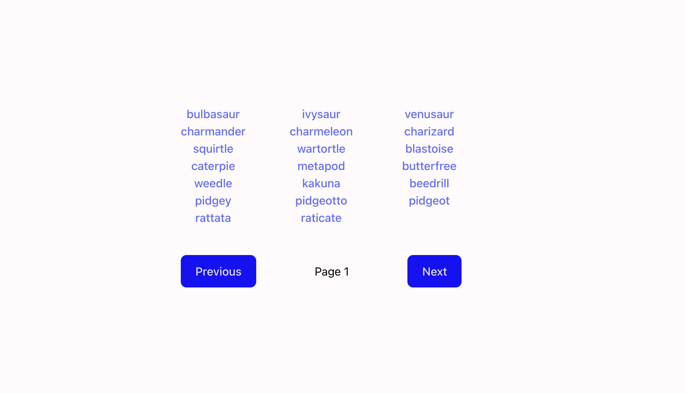

# Mini Pokedex: Pokémon API Viewer

##  Overview

In this group assignment, we followed a **driver-navigator** workflow consisting of:

- **1 Driver** – responsible for writing the code.
- **2 Navigators** – responsible for reading the instructions and guiding the driver.

The driver was not allowed to view the project requirements and relied on the navigators’ directions, reinforcing teamwork and communication.

---

## Objectives & Learning Outcomes

### Soft Skills

- **Team Collaboration**  
  Encouraged clear and concise communication, since the navigators had to explain logic and terminology for the driver to execute effectively.
  
- **Effective Instruction**  
  Navigators practiced using technical language to convey instructions clearly, while the driver developed active listening skills.

### Technical Skills

- **API Integration**  
  Utilized the [Pokémon API](https://pokeapi.co/) within a **React** application to fetch and display:
  - Pokémon sprite  
  - Height  
  - Weight

- **Tailwind CSS**  
  Installed and implemented **Tailwind CSS** to style components according to design expectations outlined by our instructor.

---

## Final Result

The final product is a simple Pokémon viewer that:

- Fetches data from the Pokémon API  
- Displays the selected Pokémon’s sprite, height, and weight  
- Is styled using Tailwind CSS to match the provided design specs

## Screenshots 

